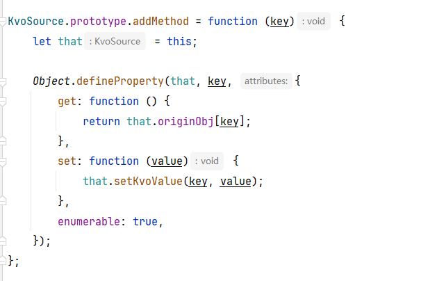

# js_event_kvo

一个用js实现的 kvo数据绑定 和 事件通知 工具，不仅限于UI层使用，在js也逐渐工程化的今天，需要一个不依赖UI纯在逻辑层使用的简单、可靠的事件和数据绑定框架；

两者的核心都是event-dispatcher这个类，里面是一个派发中心，中心里是一个connections的map结构，以action(即事件名)为key，每个key下面挂载了一个接收者列表receiverList；

receiver接收者的结构：  
```
receiver = {       
   func: func,  // 接收事件的方法
   context: context,    // 事件所属的类
   async: false  // 是否异步通知，在js里异步通知就是指在下一个tick去通知，js和Android的消息循环机制是大同小异的，只不过一般用不上多线程
}  
```

有三个关键方法：
1. addBinding(action, receiver)——监听事件，里面做了去重处理，多次调用不会重复绑定；
2. removeBinding(action, receiver);
3. dispatchEvent(action, data)——action就是事件标识，data就是通知的事件的参数;

这个结构并不是一个大而全的结构，单一职责，有一个好处就是，很简单就可以创建一个事件中心，做一个多派发中心，比如常用业务事件、网络事件等分开；

## 事件 devent

devent就是一个业务派发中心的例子，在event-dispatcher基础上做了个简单封装和一些自动绑定的逻辑，自动绑定是通过事件名来的

## kvo
kvo的实现稍微多做了一点，kvo是一个数据类，结构如下：
``` javascript
kvo = {
    originObj: 要监听的真实数据结构;
    dispatcher: 一个event-dispatcher派发中心实例;
    originObj-key1: 剩下的是在kvo实例中通过defineProperty，把原始数据结构的属性名添加进去，具体实现如下图
    originObj-key2: 
    originObj-key...: 
}
```



这样，在kvo中每个属性的名字天然地就是一个事件的key，在更新属性的值时，通过event-dispatcher进行通知，就达到了我们的目的；

问题来了：
1. kvo中的originObj和dispatcher两个属性的名字如果和原始的重名了怎么办？
这个作为一个TODO，目前的设想是弄一个 全局自增的sequence_原始数据结构的hash值_originObj 这种类型来作为originObj在kvo类中的属性名


## 总结
其实运行时数据通知大概得实现路径有两条：
1. iOS的kvo做法，把要监听的结构作为中心，然后每个属性作为key；
2. 把每个要监听的属性本身作为中心包一层，比如Android的LiveData这种；
